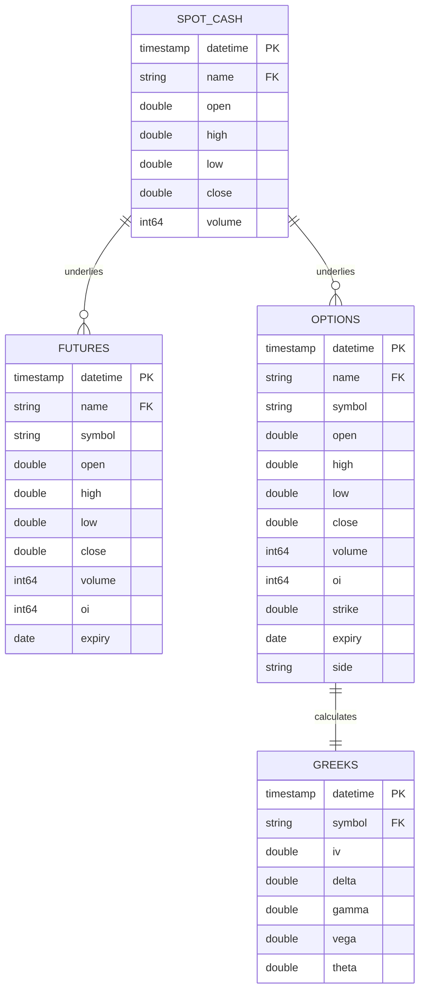

# OptionVault Database Schema

This document outlines the file layout schema, table relation maps, and typical query paradigms in OptionVault.

## 1. Relational Layout

OptionVault datasets are organized into standard tables that can be joined on `datetime`/`timestamp` and the asset identifier (`name` / `symbol`).



## 2. Common Joins & Queries

### Joint Spot-Futures OHLC Analysis
To analyze basis spreads, join `SPOT_CASH` and `FUTURES` on `datetime` and `name`:

```sql
SELECT 
    s.datetime,
    s.name,
    s.close AS spot_price,
    f.symbol AS fut_symbol,
    f.close AS fut_price,
    (f.close - s.close) AS basis_spread
FROM spot_cash s
JOIN futures f 
  ON s.datetime = f.datetime 
 AND s.name = f.name
WHERE s.name = 'RELIANCE'
ORDER BY s.datetime;
```

### Joining Options and Greeks
To calculate volatility smiles or option premium deviations:

```sql
SELECT 
    o.datetime,
    o.symbol,
    o.strike,
    o.close AS premium,
    g.iv,
    g.delta,
    g.gamma
FROM options o
JOIN greeks g 
  ON o.datetime = g.datetime 
 AND o.symbol = g.symbol
WHERE o.name = 'NIFTY'
  AND o.side = 'CE'
ORDER BY o.datetime, o.strike;
```
